# 💰 Money Log - Your Personal Salary/Budget Tracker

**Track your income, expenses, and savings effortlessly with Money Log!**

<div style="display: flex; width: 100%; overflow-x: auto; gap: 15px; align-items: center; justify-content: center;">
    
</div>

## Download App
[Dowload](./app/release/app-release.apk)


## 📌 Features
✅ **Salary Management** – Keep track of your earnings.
✅ **Expense Tracking** – Categorize and analyze your expenses.
✅ **Budget Planning** – Set budgets and stay on top of your finances.
✅ **Visual Reports** – Get insights through charts and graphs.
✅ **Data Backup & Restore** – Secure your financial data.
✅ **Dark Mode** – Enjoy an eye-friendly experience.

## 🎥 App Preview

<div style="display: flex; overflow-x: auto; gap:15px;">
    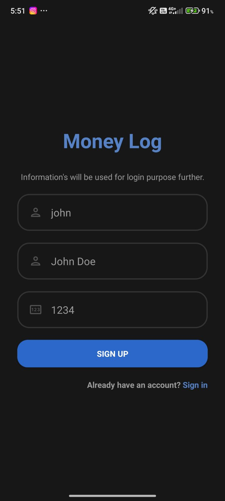
    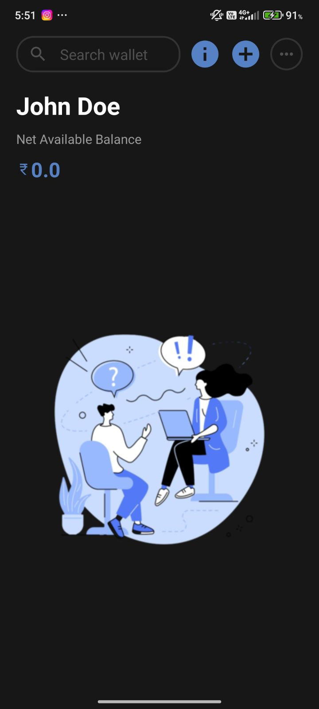
    
    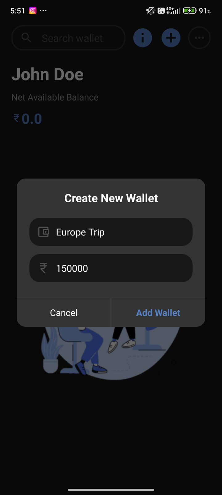
    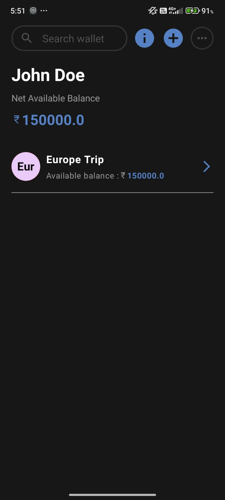
    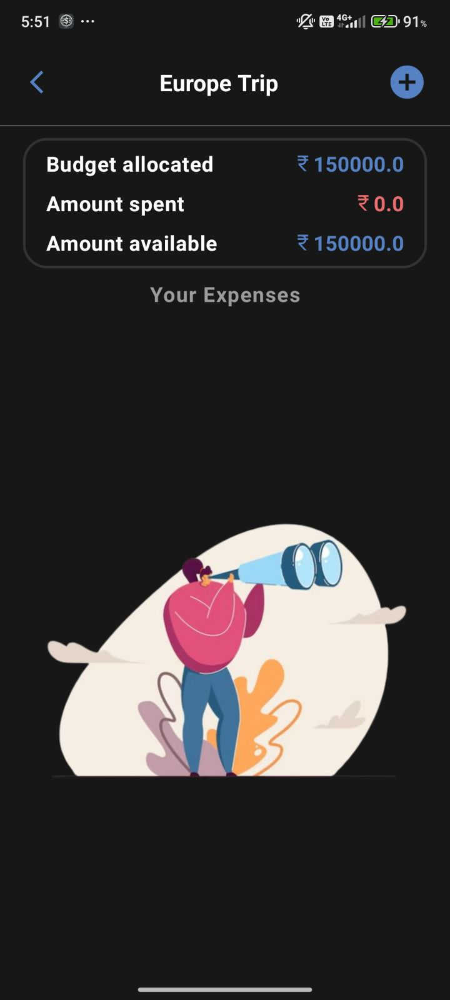
    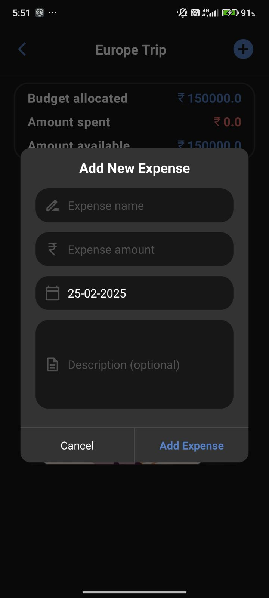
    
    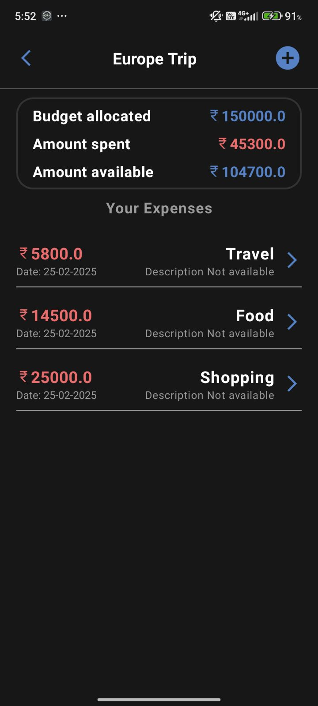
    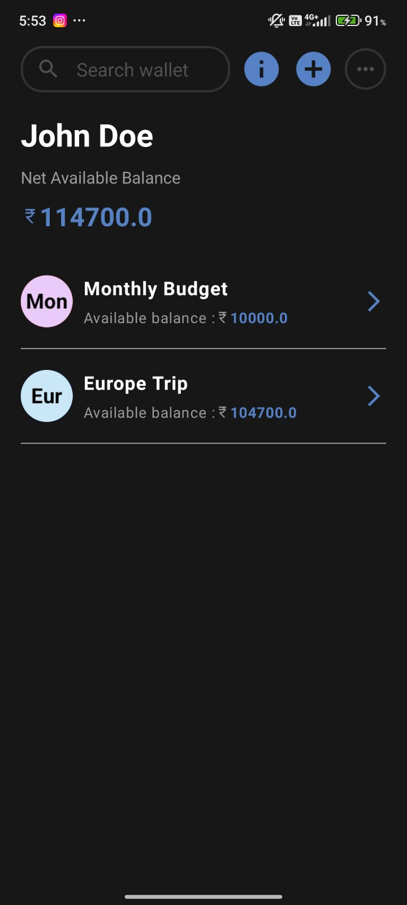
    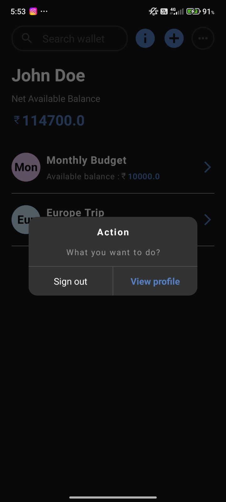
    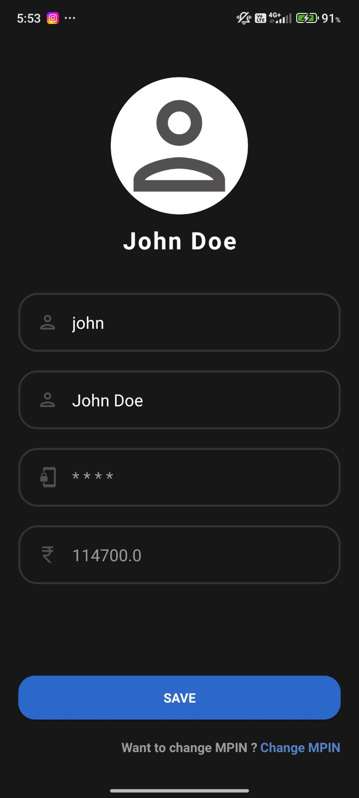
    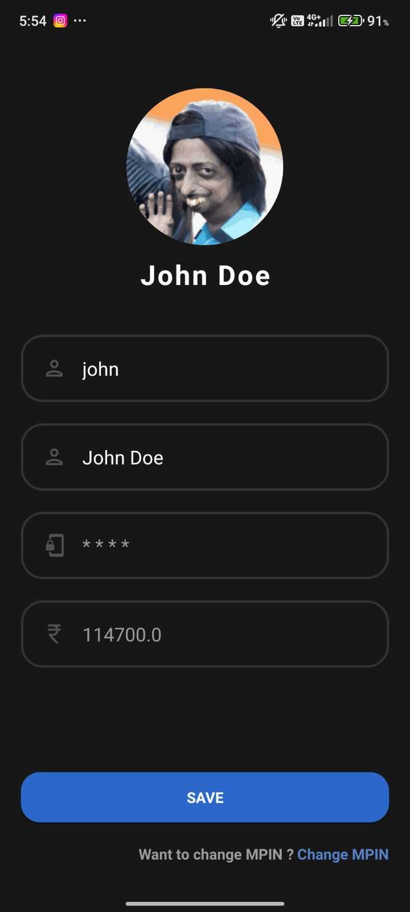
    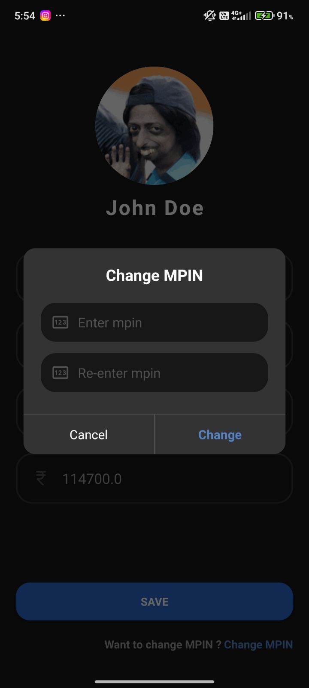
    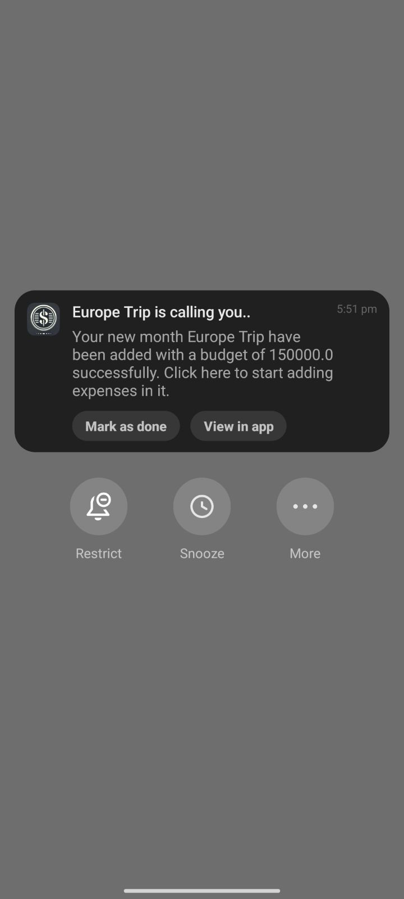
</div>


## 📲 Installation
1. **Clone the repository**
   ```sh
   git clone https://github.com/shyamkanth/Money-Log.git
   ```
2. **Open in Android Studio**
3. **Build & Run** the project on an emulator or physical device.

## 🛠️ Tech Stack
- **Kotlin** – For Android app development.
- **Room Database** – Local storage.
- **MVVM Architecture** – For clean and maintainable code.
- **Dependency Injection (Dagger Hilt)**

## 🤝 Contributing
Pull requests are welcome! If you'd like to contribute, please fork the repo and submit a PR.

## 📜 License
This project is licensed under the **APACHE License**.

---
### 💡 Stay financially smart with **Money Log**! 🚀
